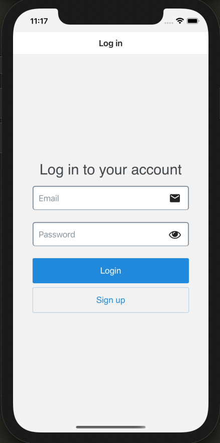
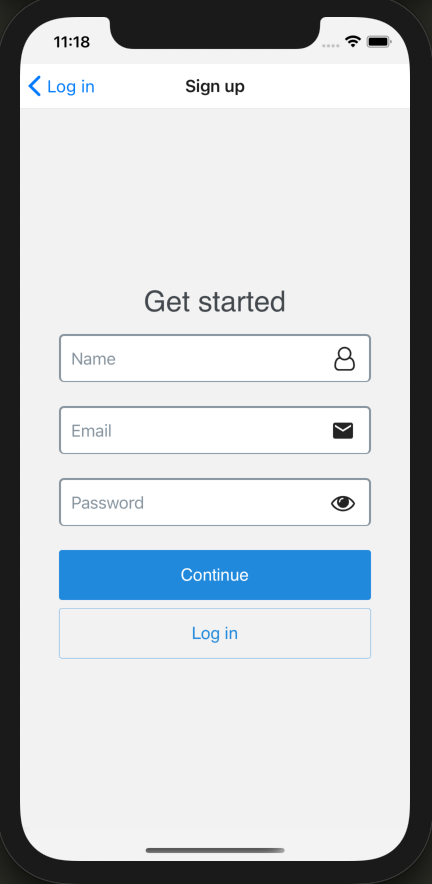
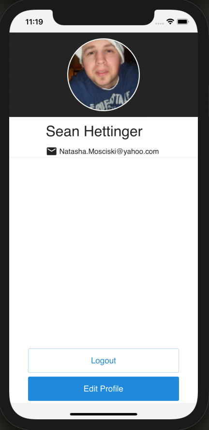
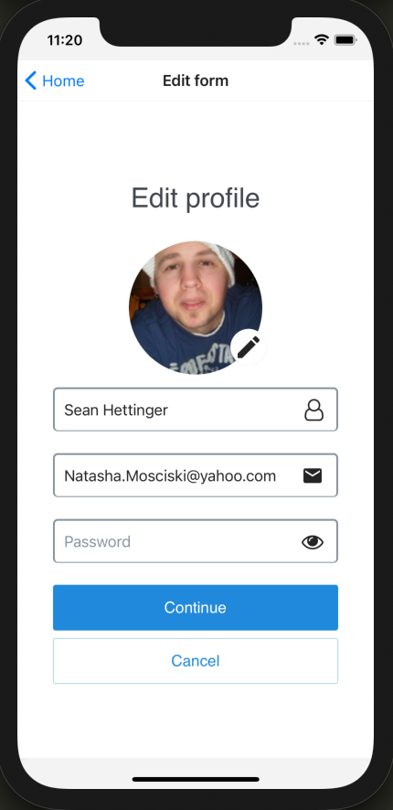

<h1 align="center">Welcome to Mobiera App 👋</h1>
<p>
  
  <a href="https://coveralls.io/github/Alver23/mobiera-app?branch=main" target="_blank">
    
  </a>
  <a href="https://github.com/Alver23/mobiera-app#readme" target="_blank">
    
  </a>
  <a href="https://github.com/Alver23/mobiera-app/graphs/commit-activity" target="_blank">
    
  </a>
  <a href="https://github.com/Alver23/mobiera-app/blob/master/LICENSE" target="_blank">
    
  </a>
  <a href="https://twitter.com/23Alver" target="_blank">
    
  </a>
  
</p>

> Mobile app with typescript, Redux Toolkit, Hooks, api Context

## Preview





## Prerequisites

Before you begin, ensure you have met the following requirements:
* Install [nodejs](https://nodejs.org/es/download/)
* Install [nvm](https://github.com/nvm-sh/nvm#installing-and-updating)
* Setup React Native environment [React Native](https://reactnative.dev/docs/environment-setup)

## Install
To install mobiera app, follow these steps:
* Clone the source locally:
  ```bash
  $ git clone https://github.com/Alver23/mobiera-app.git <project-name>
  $ cd project-name
  ``` 
* Installing dependencies:
  ```bash
  $ npm i
  ```

## Usage
* Add environment variables:
  ```bash
  $ npm run env:dev
  ```
  Note: Add an .env file in ./config/environment if you want to run the scan with sonar


* Start the server
   ```bash
    $ npm run server
    ```

* Run in iOS
  ```sh
  $ npm run ios
  ```

Or
* Run in Android
  ```sh
  $ npm run android
  ```

## Run tests

  ```sh
  $ npm run test
  ```

## Run Eslint

  ```sh
  $ npm run lint
  ```

## Clear cache
  ```sh
  $ npm run reset:cache
  ```

## Author

👤 **Alver Grisales <viga.23@hotmail.com>**

* Website: https://github.com/Alver23
* Twitter: [@23Alver](https://twitter.com/23Alver)
* Github: [@Alver23](https://github.com/Alver23)
* LinkedIn: [@alvergrisales](https://linkedin.com/in/alvergrisales)

## 🤝 Contributing

To contribute to Mobile app, follow these steps:
1. Fork this repository.
2. Create a branch: `git checkout -b <branch_name>`.
3. Make your changes and commit them: `git commit -m '<commit_message>'`
4. Push to the original branch: `git push origin <project_name>/<location>`
5. Create the pull request.

Alternatively see the GitHub documentation on [creating a pull request](https://help.github.com/en/github/collaborating-with-issues-and-pull-requests/creating-a-pull-request)

## Show your support

Give a ⭐️ if this project helped you!

## 📝 License

Copyright © 2021 [Alver Grisales <viga.23@hotmail.com>](https://github.com/Alver23).<br />
This project is [MIT](https://github.com/Alver23/mobiera-app/blob/master/LICENSE) licensed.

***
_This README was generated with ❤️ by [readme-md-generator](https://github.com/kefranabg/readme-md-generator)_
